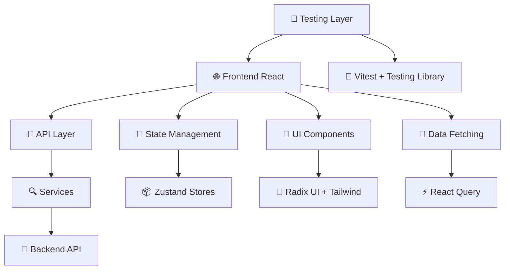

# 🤖 JARVIS Web

**Sistema de Gerenciamento de Visitantes e Controle de Acesso**

Uma aplicação web moderna para controle de visitantes, histórico de acessos e monitoramento de logs em tempo real, inspirada no assistente virtual J.A.R.V.I.S.


## 📋 Índice

- [✨ Funcionalidades](#-funcionalidades)
- [🏗️ Arquitetura](#️-arquitetura)
- [🚀 Como Executar](#-como-executar)
- [📁 Estrutura do Projeto](#-estrutura-do-projeto)
- [🧪 Testes](#-testes)
- [🛠️ Stack Tecnológica](#️-stack-tecnológica)
- [📝 Scripts Disponíveis](#-scripts-disponíveis)
- [🔧 Configuração](#-configuração)
- [🤝 Contribuição](#-contribuição)

## ✨ Funcionalidades

### 🏠 Dashboard Principal

- **Cadastro de Visitantes**: Formulário completo com validação
- **Controle de Salas**: Visualização de capacidade e ocupação
- **Check-in/Check-out**: Registro de entrada e saída
- **Busca e Filtros**: Pesquisa por nome, CPF ou sala
- **Densidade Visual**: Modo compacto/confortável

### 📊 Histórico de Visitas

- **Timeline Completa**: Histórico de todos os acessos
- **Filtros Avançados**: Por data, sala, visitante
- **Paginação**: Navegação eficiente de registros
- **Exportação**: Relatórios em diferentes formatos

### 📝 Logs do Sistema

- **Monitoramento em Tempo Real**: Auto-refresh configurável
- **Níveis de Log**: Error, Warning, Info, Debug
- **Filtros por Período**: Seleção de data/hora
- **Busca Textual**: Pesquisa em conteúdo dos logs

### 🔐 Autenticação

- **Login Seguro**: Credenciais validadas
- **Gestão de Token**: JWT com localStorage
- **Logout Seguro**: Limpeza completa de sessão
- **Rotas Protegidas**: Controle de acesso

### 🎨 Interface e UX

- **Design System**: Componentes consistentes
- **Dark/Light Mode**: Tema adaptável
- **Responsivo**: Mobile-first design
- **Toasts**: Feedback visual para ações
- **Loading States**: Indicadores de carregamento

## 🏗️ Arquitetura



### 📐 Padrões Arquiteturais

- **📁 Feature-Based Structure**: Organização por domínio
- **🔄 Unidirectional Data Flow**: React Query + Zustand
- **🧩 Component Composition**: Radix UI primitives
- **🎯 Single Responsibility**: Funções especializadas
- **📝 Type Safety**: TypeScript em toda aplicação

## 🚀 Como Executar

### 📋 Pré-requisitos

```bash
node >= 18.0.0
npm >= 9.0.0
```

### 🔧 Instalação

```bash
# 1. Clone o repositório
git clone https://github.com/guilhermewall/jarvis-web.git
cd jarvis-web

# 2. Instale as dependências
npm install

# 3. Configure as variáveis de ambiente
cp .env.example .env
# Edite o arquivo .env com suas configurações

# 4. Execute o projeto
npm run dev
```

### 🌐 Acessos

- **Aplicação**: http://localhost:5173
- **Login padrão**:
  - Email: `admin@stark.com`
  - Senha: `admin123`

### 🏭 Produção

```bash
# Build para produção
npm run build

# Preview do build
npm run preview

# Deploy (configure conforme sua plataforma)
npm run build && surge dist/ jarvis-web.surge.sh
```

## 📁 Estrutura do Projeto

```
jarvis-web/
├── 📂 public/                    # Assets estáticos
├── 📂 src/
│   ├── 📂 components/           # Componentes React
│   │   ├── 📂 ui/              # Componentes base (shadcn/ui)
│   │   ├── 📂 layout/          # Layouts da aplicação
│   │   └── 📂 domain/          # Componentes específicos
│   │       ├── 📂 dashboard/   # Dashboard e visitantes
│   │       ├── 📂 history/     # Histórico de visitas
│   │       └── 📂 logs/        # Logs do sistema
│   ├── 📂 hooks/               # Custom hooks
│   │   ├── 📂 auth/           # Hooks de autenticação
│   │   └── 📂 ui/             # Hooks de interface
│   ├── 📂 lib/                 # Utilitários e configurações
│   │   ├── 📂 api/            # Cliente API
│   │   ├── 📂 schema/         # Schemas de validação (Zod)
│   │   ├── 📂 utils/          # Funções utilitárias
│   │   ├── auth.ts            # Gerenciamento de autenticação
│   │   ├── navigation.tsx     # Configuração de navegação
│   │   └── toast.ts           # Sistema de notificações
│   ├── 📂 pages/              # Páginas da aplicação
│   │   ├── dashboard.tsx      # Página principal
│   │   ├── history.tsx        # Página de histórico
│   │   ├── logs.tsx          # Página de logs
│   │   └── login.tsx         # Página de login
│   ├── 📂 routes/             # Configuração de rotas
│   ├── 📂 services/           # Serviços de API
│   ├── 📂 stores/             # Estados globais (Zustand)
│   ├── 📂 types/              # Definições TypeScript
│   └── 📂 __tests__/          # Suíte de testes
│       ├── 📂 components/     # Testes de componentes
│       ├── 📂 hooks/          # Testes de hooks
│       ├── 📂 services/       # Testes de serviços
│       ├── 📂 stores/         # Testes de stores
│       └── 📂 utils/          # Utilitários de teste
├── 📄 vitest.config.ts        # Configuração do Vitest
├── 📄 vitest.setup.ts         # Setup dos testes
├── 📄 tailwind.config.js      # Configuração do Tailwind
├── 📄 tsconfig.json           # Configuração TypeScript
└── 📄 vite.config.ts          # Configuração do Vite
```

### 🗂️ Organização por Domínio

#### 🏠 Dashboard Domain

```
domain/dashboard/
├── dashboard-header.tsx         # Cabeçalho com controles
├── dashboard-filters.tsx        # Filtros de busca
├── create-visitor-modal.tsx     # Modal de cadastro
├── visitors-table.tsx           # Tabela de visitantes
├── visitors-row.tsx             # Linha da tabela
└── room-cards.tsx               # Cards de salas
```

#### 📊 History Domain

```
domain/history/
├── history-header.tsx           # Cabeçalho do histórico
├── history-filters.tsx          # Filtros de histórico
└── history-table.tsx            # Tabela de histórico
```

#### 📝 Logs Domain

```
domain/logs/
├── logs-header.tsx              # Cabeçalho dos logs
├── logs-filters.tsx             # Filtros de logs
└── logs-table.tsx               # Tabela de logs
```

## 🧪 Testes

### 📊 Cobertura Atual

| Métrica      | Atual  | Meta | Status      |
| ------------ | ------ | ---- | ----------- |
| **Linhas**   | 74.61% | 80%  | 🟡 Próximo  |
| **Branches** | 81.41% | 70%  | ✅ Atingido |
| **Funções**  | 65.15% | 75%  | 🟡 Próximo  |

### 🧪 Comandos de Teste

```bash
# Executar todos os testes
npm test

# Executar com cobertura
npm run test:coverage

# Modo watch (desenvolvimento)
npm run test:ui

# Executar testes específicos
npx vitest run src/__tests__/stores/
```

### 🔬 Tipos de Teste

- **🧩 Unit Tests**: Componentes, hooks, utilitários
- **🔗 Integration Tests**: Fluxos completos
- **📡 API Tests**: Mocks com MSW
- **🎯 E2E Tests**: Casos de uso principais

### 📋 Estrutura de Testes

```
__tests__/
├── 📂 components/
│   └── 📂 domain/              # Testes de componentes por domínio
├── 📂 hooks/                   # Testes de custom hooks
├── 📂 services/                # Testes de serviços API
├── 📂 stores/                  # Testes de stores Zustand
├── 📂 lib/                     # Testes de utilitários
└── 📂 utils/                   # Utilitários de teste
    ├── factories.ts            # Factories de dados
    ├── handlers.ts             # MSW handlers
    ├── mocks.ts                # Mocks globais
    └── test-utils.tsx          # Utilities de teste
```

## 🛠️ Stack Tecnológica

### 🎯 Frontend Core

- **⚛️ React 19.1.1**: Library principal
- **📘 TypeScript 5.8.3**: Type safety
- **⚡ Vite 7.1.0**: Build tool e dev server
- **🎨 Tailwind CSS 4.1.11**: Styling framework

### 🧩 UI & Componentes

- **🎭 Radix UI**: Primitivos acessíveis
- **🎨 CVA**: Class Variance Authority
- **🔀 Framer Motion**: Animações
- **🎯 Lucide React**: Ícones

### 📡 Estado & Dados

- **🐻 Zustand 5.0.7**: Estado global
- **⚡ React Query 5.84.2**: Data fetching
- **📝 React Hook Form 7.62.0**: Formulários
- **✅ Zod 4.0.17**: Validação de schemas

### 🛠️ Networking & Utils

- **📡 Axios 1.11.0**: Cliente HTTP
- **🌐 React Router Dom 7.8.0**: Roteamento
- **🌙 Next Themes 0.4.6**: Tema dark/light
- **🔔 Sonner 2.0.7**: Notificações toast

### 🧪 Testing & Quality

- **🔬 Vitest 3.2.4**: Test runner
- **🧪 Testing Library**: Testes de componentes
- **📊 Coverage V8**: Cobertura de código
- **🎭 MSW 2.10.4**: API mocking
- **📝 Faker.js**: Geração de dados

### 🔧 DevTools & Linting

- **📏 ESLint 9.32.0**: Linting
- **💅 Prettier 3.6.2**: Formatação
- **🐺 Husky 9.1.7**: Git hooks
- **📦 Lint Staged**: Pre-commit linting
- **📝 Commitlint**: Commit conventions

## 📝 Scripts Disponíveis

```bash
# 🚀 Desenvolvimento
npm run dev              # Inicia servidor de desenvolvimento
npm run build            # Build para produção
npm run preview          # Preview do build local

# 🧪 Testes
npm test                 # Executa todos os testes
npm run test:ui          # Interface de testes (modo watch)
npm run test:coverage    # Executa com relatório de cobertura

# 🔍 Qualidade de Código
npm run lint             # Verifica problemas de lint
npm run lint:fix         # Corrige problemas automaticamente
npm run format           # Formata código com Prettier
npm run format:check     # Verifica formatação
npm run typecheck        # Verifica tipos TypeScript

# 🔧 Utilitários
npm run prepare          # Setup dos hooks do Husky
```

## 🔧 Configuração

### 🌍 Variáveis de Ambiente

```bash
# .env
VITE_API_BASE_URL=http://localhost:3000/api
VITE_APP_TITLE=JARVIS Web
VITE_APP_VERSION=1.0.0
```

### 🎨 Personalização de Tema

```typescript
// tailwind.config.js
module.exports = {
  theme: {
    extend: {
      colors: {
        // Cores customizadas do tema
        primary: {
          /* ... */
        },
        secondary: {
          /* ... */
        },
      },
    },
  },
};
```

### 🔄 Configuração de API

```typescript
// src/lib/api/client.ts
export const api = axios.create({
  baseURL: import.meta.env.VITE_API_BASE_URL,
  timeout: 10000,
  headers: {
    "Content-Type": "application/json",
  },
});
```

## 🎯 Funcionalidades Principais

### 🏠 Sistema de Dashboard

- ✅ Cadastro completo de visitantes
- ✅ Controle de entrada/saída
- ✅ Visualização de ocupação por sala
- ✅ Filtros e busca em tempo real
- ✅ Validação de formulários

### 📊 Histórico Detalhado

- ✅ Timeline de todas as visitas
- ✅ Filtros por período, sala, visitante
- ✅ Paginação server-side
- ✅ Export de relatórios

### 📝 Monitoramento de Logs

- ✅ Visualização em tempo real
- ✅ Auto-refresh configurável
- ✅ Filtros por nível de log
- ✅ Busca em conteúdo

### 🔐 Autenticação Robusta

- ✅ Login com JWT
- ✅ Rotas protegidas
- ✅ Logout seguro
- ✅ Renovação automática de token

## 🚀 Deploy e Produção

### 🐳 Docker (Recomendado)

```dockerfile
FROM node:18-alpine
WORKDIR /app
COPY package*.json ./
RUN npm ci --only=production
COPY . .
RUN npm run build
EXPOSE 5173
CMD ["npm", "run", "preview"]
```

### ☁️ Plataformas Suportadas

- **Vercel**: Deploy automático
- **Netlify**: JAMstack otimizado
- **AWS S3 + CloudFront**: Distribuição global
- **GitHub Pages**: Hospedagem gratuita

## 🤝 Contribuição

### 📋 Como Contribuir

1. **Fork** o projeto
2. **Crie** uma branch para sua feature (`git checkout -b feature/nova-funcionalidade`)
3. **Commit** suas mudanças (`git commit -m 'feat: adiciona nova funcionalidade'`)
4. **Push** para a branch (`git push origin feature/nova-funcionalidade`)
5. **Abra** um Pull Request

### 📝 Convenções

- **Commits**: Conventional Commits
- **Branches**: `feature/`, `fix/`, `docs/`
- **Code Style**: ESLint + Prettier
- **Tests**: Cobertura mínima de 75%

### 🐛 Reportar Bugs

Use as [Issues do GitHub](https://github.com/guilhermewall/jarvis-web/issues) para reportar bugs ou solicitar features.

---

<div align="center">

**🤖 JARVIS Web** - Sistema de Controle de Visitantes

Desenvolvido com ❤️ por [Guilherme](https://github.com/guilhermewall)

[🌟 Dar Star](https://github.com/guilhermewall/jarvis-web) · [🐛 Reportar Bug](https://github.com/guilhermewall/jarvis-web/issues) · [💡 Request Feature](https://github.com/guilhermewall/jarvis-web/issues)

</div>
